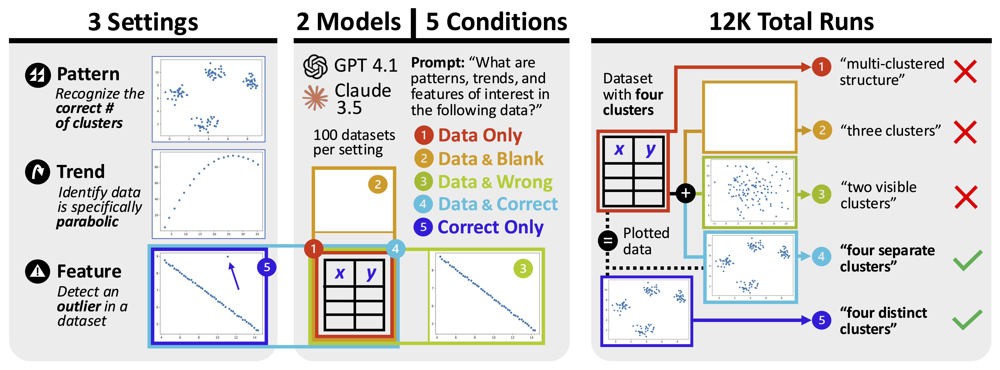

# Does visualization help AI understand data?

Charts and graphs help people analyze data, but can they also be useful to AI systems? Our paper studies how visualization impacts the ability for AI systems to observe and synthesize patterns, trends, and features of quantitative datasets. By generating synthetic data for classic real-world analysis tasks, we find that GPT 4.1 and Claude 3.5, like humans, describe data more accurately and precisely with visualizations.

This repo contains data and code relevant to our experimental setup:

- Synthetic data for each task is generated via notebooks in `experiment/data_generation`
- Models generate responses via `experiment/generate_responses.py` 
- LVLM judge code and prompts used for the clustering and outlier tasks are found in `experiment/lvlm_judge`
- Generated datasets, model responses, and judge classifications are available in `data`
- Analysis was conducted and figures were produced via notebooks in `analysis`

This repository also includes `supplementary_materials`, containing additional analysis of models' failure mode behavior, output token length, and use of statistical terminology.
